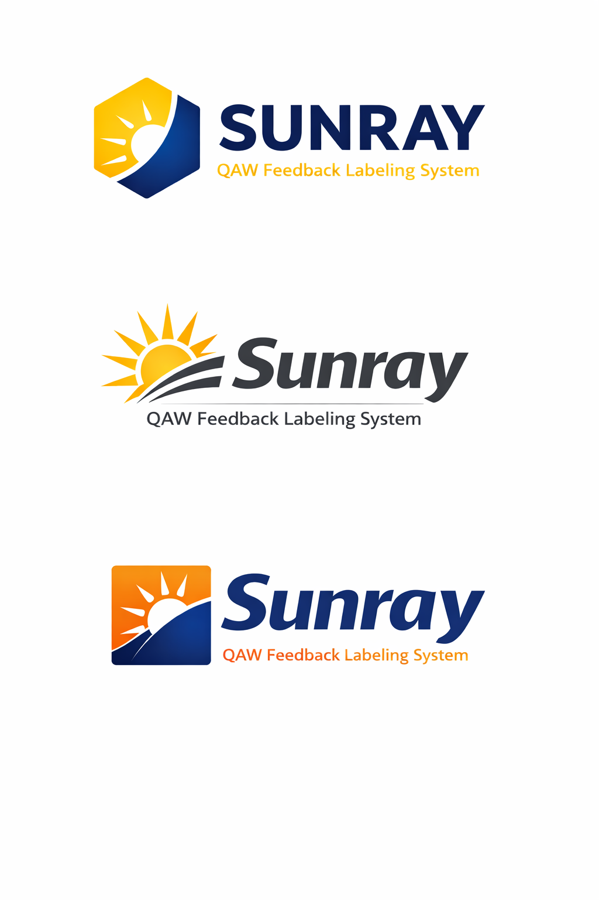

# Sunray Feedback Labeling System

AI-powered customer feedback analysis - replaces Sunbeam AI solution.



## What It Does

- Reads customer feedback from S3 (`ingress/`)
- Labels feedback using AI (category, sentiment, priority, language)
- Outputs structured JSON to S3 (`egress/`)
- Archives processed files automatically

## Supported Languages

Finnish, English, Estonian, Latvian, Lithuanian

## Available Solutions

We provide **three different AI backends** - choose based on your needs:

| Solution | Cost (10K/mo) | Quality | Setup Time | Restrictions |
|----------|---------------|---------|------------|--------------|
| **Amazon Comprehend** | $10-30 | Good | 5 min | None |
| **Anthropic Direct API** | $50-150 | Excellent | 10 min | Requires API key |
| **AWS Bedrock Nova** | $1-50 | Very Good | 5 min | May have SCP/channel restrictions |

## Architecture
```
S3 ingress/ → Lambda → AI Model → Lambda → S3 egress/
```

## Prerequisites

1. AWS Account
2. AWS CLI configured
3. **For Anthropic API**: API key from [console.anthropic.com](https://console.anthropic.com)

---

## Solution 1: Amazon Comprehend (Recommended for POC)

**Best for**: Quick setup, low cost, no external dependencies

### Deploy
```bash
aws cloudformation create-stack \
  --stack-name sunray-feedback-comprehend-dev \
  --template-body file://sunray-feedback-labeling-comprehend.yaml \
  --parameters ParameterKey=Environment,ParameterValue=dev \
  --capabilities CAPABILITY_NAMED_IAM \
  --region eu-central-1
```

### Pros/Cons
✅ Cheapest option  
✅ No external dependencies  
✅ Works in Frankfurt, Ireland, Stockholm  
⚠️ Basic keyword-based categorization  
⚠️ Lower accuracy than LLM solutions  

---

## Solution 2: Anthropic Direct API (Recommended for Production)

**Best for**: High quality analysis, no AWS restrictions

### Get API Key
1. Sign up at [console.anthropic.com](https://console.anthropic.com)
2. Create an API key
3. Copy the key (starts with `sk-ant-`)

### Deploy
```bash
aws cloudformation create-stack \
  --stack-name sunray-feedback-anthropic-dev \
  --template-body file://sunray-feedback-labeling-anthropic-api.yaml \
  --parameters ParameterKey=Environment,ParameterValue=dev \
               ParameterKey=AnthropicApiKey,ParameterValue=sk-ant-YOUR-KEY-HERE \
               ParameterKey=ClaudeModel,ParameterValue=claude-3-haiku-20240307 \
  --capabilities CAPABILITY_NAMED_IAM \
  --region eu-central-1
```

### Pros/Cons
✅ Excellent quality (same as Claude)  
✅ No AWS SCP/channel program restrictions  
✅ Supports all languages well  
⚠️ Data leaves AWS (goes to api.anthropic.com)  
⚠️ Higher cost than Comprehend  
⚠️ Requires external API key management  

---

## Solution 3: AWS Bedrock Nova

**Best for**: AWS-native solution (if SCPs allow)

### Deploy
```bash
aws cloudformation create-stack \
  --stack-name sunray-feedback-nova-dev \
  --template-body file://sunray-feedback-labeling-bedrock-nova.yaml \
  --parameters ParameterKey=Environment,ParameterValue=dev \
               ParameterKey=NovaModelId,ParameterValue=eu.amazon.nova-micro-v1:0 \
  --capabilities CAPABILITY_NAMED_IAM \
  --region eu-central-1
```

### Pros/Cons
✅ AWS-native (data stays in AWS)  
✅ Good quality  
✅ Flexible model selection  
⚠️ May have Service Control Policy restrictions  
⚠️ May have channel program account restrictions  
⚠️ Requires cross-region permissions  

---

## Usage (All Solutions)

### 1. Create S3 Folders
```bash
# Get bucket name from stack outputs
BUCKET=$(aws cloudformation describe-stacks \
  --stack-name YOUR-STACK-NAME \
  --query 'Stacks[0].Outputs[?OutputKey==`BucketName`].OutputValue' \
  --output text)

# Create folders
aws s3api put-object --bucket $BUCKET --key ingress/
aws s3api put-object --bucket $BUCKET --key egress/
aws s3api put-object --bucket $BUCKET --key archive/
```

### 2. Upload Test Feedback
```bash
# Create sample file
cat > sample-feedback.json << 'EOF'
[
  {
    "id": "fb001",
    "feedback": "Todella hyvä palvelu, kiitos!",
    "customer_id": "12345",
    "timestamp": "2026-01-16T10:30:00Z"
  },
  {
    "id": "fb002", 
    "feedback": "Couldn't complete my purchase, payment failed",
    "customer_id": "67890",
    "timestamp": "2026-01-16T11:15:00Z"
  },
  {
    "id": "fb003",
    "feedback": "Selection is quite poor",
    "customer_id": "11111",
    "timestamp": "2026-01-16T12:00:00Z"
  }
]
EOF

# Upload to trigger processing
aws s3 cp sample-feedback.json s3://$BUCKET/ingress/
```

### 3. Check Results
```bash
# Wait 10-30 seconds, then check egress
aws s3 ls s3://$BUCKET/egress/

# Download result
aws s3 cp s3://$BUCKET/egress/sample-feedback_labeled_*.json result.json

# View result
cat result.json | python3 -m json.tool
```

## Output Format

All solutions produce the same JSON structure:
```json
[
  {
    "id": "fb001",
    "feedback": "Todella hyvä palvelu, kiitos!",
    "customer_id": "12345",
    "timestamp": "2026-01-16T10:30:00Z",
    "labels": {
      "category": "service",
      "sentiment": "positive",
      "subcategory": "great_service",
      "language": "fi",
      "priority": "low",
      "summary": "Customer praises service quality",
      "confidence": "high"
    },
    "processed_at": "2026-01-16T15:09:47.690778",
    "processor": "anthropic-api",
    "model": "claude-3-haiku-20240307",
    "environment": "dev"
  }
]
```

## Cost Comparison (10,000 feedbacks/month)

| Solution | Monthly Cost | Notes |
|----------|--------------|-------|
| Comprehend | $10-30 | + Lambda (~$0) + S3 (~$0.10) |
| Anthropic API (Haiku) | $50-150 | + Lambda (~$0) + S3 (~$0.10) + Secrets ($0.40) |
| Anthropic API (Sonnet) | $300-1,500 | + Lambda (~$0) + S3 (~$0.10) + Secrets ($0.40) |
| Bedrock Nova (Micro) | $1-3 | + Lambda (~$0) + S3 (~$0.10) |
| Bedrock Nova (Lite) | $2-5 | + Lambda (~$0) + S3 (~$0.10) |

**All solutions are pay-as-you-go** - no static costs, you only pay when processing feedback.

## Monitoring

View logs in CloudWatch:
```bash
# Comprehend
aws logs tail /aws/lambda/sunray-feedback-comprehend-dev-labeling-function --follow

# Anthropic API
aws logs tail /aws/lambda/sunray-feedback-anthropic-dev-labeling-function --follow

# Bedrock Nova
aws logs tail /aws/lambda/sunray-feedback-nova-dev-labeling-function --follow
```

## Troubleshooting

### Comprehend
- **No output**: Check CloudWatch logs for API errors
- **Wrong language detected**: Comprehend auto-detects, may misidentify short text

### Anthropic API
- **Authentication failed**: Check API key in Secrets Manager
- **Rate limits**: Anthropic has rate limits on free tier

### Bedrock Nova
- **Access denied (SCP)**: Contact AWS admin to allow cross-region Bedrock access
- **Access denied (channel program)**: Use Comprehend or Anthropic API instead
- **Model not found**: Verify model ID for your region

### General
- **"Model identifier is invalid"**: Enable Anthropic models via [Bedrock Playground](https://console.aws.amazon.com/bedrock/home?region=eu-west-1#/playground/chat)
- **No output files**: Check Lambda logs in CloudWatch for errors
- **Stack creation fails**: Ensure bucket name is globally unique
- **"Access to this model is not available for channel program accounts"**: Select an diffrent model, or create an request to channel program retailer to change limits

## Cleanup
```bash
# Delete S3 objects first (required)
aws s3 rm s3://BUCKET-NAME --recursive

# Delete stack
aws cloudformation delete-stack --stack-name STACK-NAME --region eu-central-1
```

## Files in This Repository
```
.
├── sunray-feedback-labeling-comprehend.yaml      # Amazon Comprehend solution
├── sunray-feedback-labeling-anthropic-api.yaml   # Anthropic Direct API solution
├── sunray-feedback-labeling-bedrock-nova.yaml    # AWS Bedrock Nova solution
├── sample-feedback.json                          # Test data
└── README.md                                     # This file
```

## Support

For issues or questions:
1. Check CloudWatch logs
2. Verify S3 folder structure (ingress/, egress/, archive/)
3. Ensure IAM permissions are correct
4. Review stack outputs for configuration details

---

**Built with ❤️ for QAW feedback analysis**